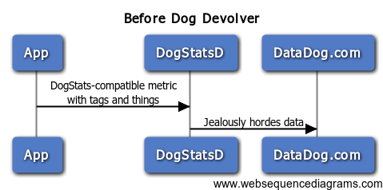
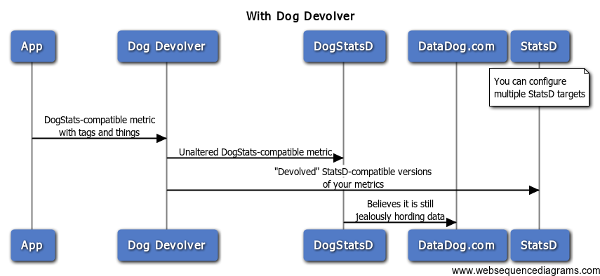

# dog-devolver

Dog Devolver is a DogStatsD proxy and StatsD-compatible devolving forwarder. You send your client traffic directly to Dog Devolver. It will then send fully-formed DogStatsD-compatible packets to your DogStatsD client. It'll also send StatsD-compatible versions of those packets to any StatsDs that you want.

Look, I probably explained that poorly. Here are some fancy charts. Here's your life now:



Then you stick Dog Devolver in the middle, and then your life is like this:



### But why?

DataDog is really cool, but there are also some neat tools like [Skyline](https://github.com/etsy/skyline) that are part of a StatsD-specific ecosystem. DogStatsD uses a modified StatsD format, plus it jealously guards the packets it receives and doesn't give you a way to easily forward them. Dog Devolver solves this problem for you, because when it comes to choosing between DataDog and Skyline...


### Running Dog Devolver

```
godep restore
go build
./dog-devolver
```

#### Environment Variables

* DOG_DEVOLVER_LOG_TO: If provided, logs are written to the file specified. Otherwise, they go to `stderr`.
* DOG_DEVOLVER_LISTEN_IP: IP spec on which to bind for incoming UDP messages. Defaults to 127.0.0.1
* DOG_DEVOLVER_LISTEN_PORT: Port on which to bind for incoming UDP messages. Defaults to 9000
* DOG_DEVOLVER_DOGSTATSD_HOST: IP or hostname of the DogStatsD to forward unaltered packets to
* DOG_DEVOLVER_DOGSTATSD_PORT: Port of the DogStatsD to forward unaltered packets to

Dog Devolver supports forwarding devolved packets to multiple downstream StatsD services. Each is specified as such, replacing `N` with an integer (starting at 0):

* DOG_DEVOLVER_STATSD_HOST_N: IP or hostname of a StatsD to forward devolved (StatsD-compatible) packets to
* DOG_DEVOLVER_STATSD_PORT_N: Port of a StatsD to forward devolved (StatsD-compatible) packets to
